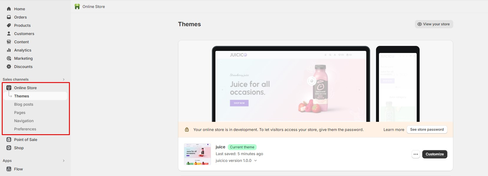
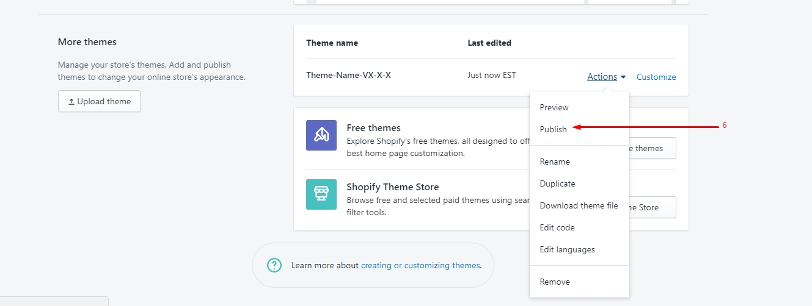
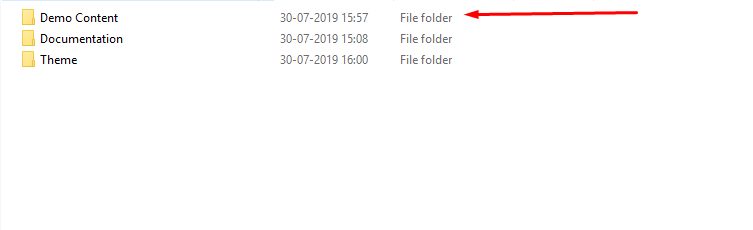
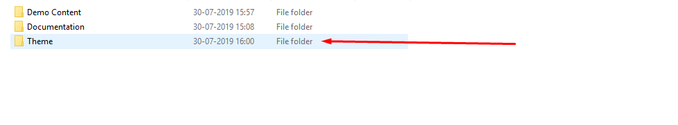
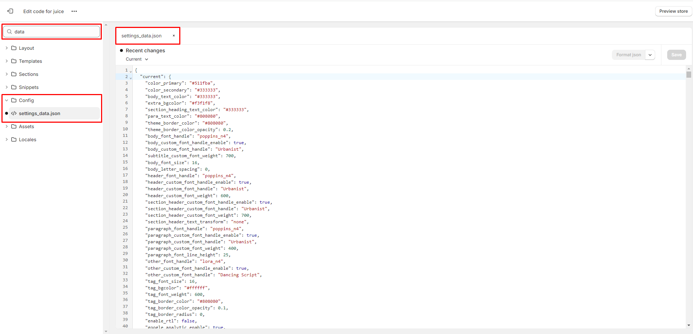

## User Documentation

Helpful information about Shopify 2.0 Store.

## Categories

- [Introduction](#introduction)
- [Files Included](#filesincluded)
- [Installation](#theme-installation)

## Introduction

Thank you very much for choosing our theme. We truly appreciate and really hope that you'll enjoy our theme!

**If you like this theme, Please support us by rating us 5 stars..** ★★★★★

Our Shopify 2.0 theme is a Fully Responsive Shopify Theme for selling multipurpose and etc. It has a fully responsive width that adjusts automatically to any screen size or resolution.

**Trending Header Style, Advanced Footer Style, Unique Home page, Fully responsive, Sections, Shopify Builder, Drag & Drop, Mailchimp, Contact Form, Powerful Theme Option, Page option.**

### Theme features

- Quick Install
- Shopify Builder
- Newsletter Popup
- Slideshow
- Ajax Popup Cart
- Ajax Wishlist
- QuickView
- Feature Product
- Product With Carousel
- Multiple Banner
- Instafeed
- Brand Logo
- Newsletter
- Testimonial
- Our Services
- Footer Content
- Facebook comment
- Product review
- Custom Tab
- Shortcodes
- Google Analytics
- Fully Responsive
- Cross Browser Optimization
- Well Documentation

### Need Support?

If you have any questions regarding theme issues, please submit a ticket via Template Monsters.

## Files Included

- Demo Content - (Demo Products)
- Help - (Documentation, theme-install, import-demo)
- Theme File Needs to Upload - (ThemeNameV1-0-0.zip)

## Theme Installation

Extract your download file and upload Theme file (ThemeNameV1-0-0.zip).

### Install theme via Shopify Dashboard

- Login to the Shopify backend and click "Online Store"
- Finally, Publish it

## Import Demo Content

If you want to design your store like our demo/preview site:

1. Demo content files are included in the downloadable file (that you have downloaded from our marketplace)
2. Go to the "Demo Content" folder and open the "quick_setup" folder

3. Choose any quick_setup file, open it using any text editor (e.g. notepad, notepad++) and copy all the code.
4. Now go to your online Shopify store backend, Click "Online Store"
5. Click on “Actions” button then click "Edit Code"

- Open the "settings_data.json" file and paste the copied code here

Now save it and you're done.